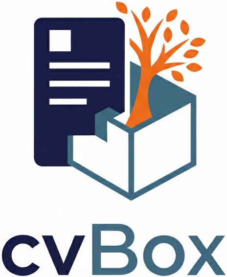

### About cvBox

Managing multiple versions of your CV over the years can be surprisingly complicated. Each job application may require a slightly different CV, and keeping track of what you sent, when, and for which purpose often leads to confusion and wasted time. cvBox was created to solve this problem in the simplest (and rough) way possible.

cvBox is a single HTML file that lets you organize all your CV versions in a **tree structure**. Fixed sections, like Personal Information, Experience, and Education, stay the same across all versions, while dynamic sections, such as Skills, Projects, Certifications, Publications, and Languages, can vary from one version to another. This approach allows you to track the history of your CV, create new versions without starting from the beginning, and quickly copy them as Markdown or save the full structure as a JSON file.

One key feature is that the CV is **rendered in Markdown in real time** within the interface. This means you can immediately see the structure of your CV and, once exported, edit it quickly in Word, Pages, or any Markdown reader.

All of this works with just **two files**: `cvBox.html` for the interactive editor, and the exported `.json` file to store your CV tree.

---

### How it works

- Open `cvBox.html` in your browser.
- Fill the root: Personal Information, Education, and Experience. (only the first time) 
- Add child and fill the dynamic sections for Skills, Projects, or any other details that may differ between CV versions.  

NB: Each new version appears as a branch in the tree. If I add a section in the branch "A", only the branch "A" and all its child will be changed.    

Export a single version as Markdown or export the full tree as JSON. Markdown output can be easily edited later in Word, Pages, or any Markdown reader.

If you need to add a new version or modify any version of your CVs, click on cvBox.html file and import the last .json file!

cvBox is deliberately simple but highly effective to save time and to reduce confusion.

---

### Installation

No installation is required. Just open `cvBox.html` in your browser.

---

### License

This project is open source and free to use for personal purposes.
